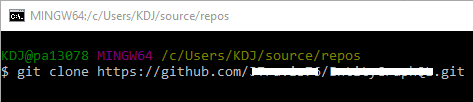

#meta-start
Title:Reset a Forked Git Branch
Created:3-18-2020
Category:git
#meta-end
# Reset a Forked Git branch
---
While collaborating with fellow developers on Github, I find myself needing to updated my fork repository to match the original owner's repository. This is important to maintain clean up-to-date code while adding new features and bug fixes, especially after a pull request has been completed.

> Will need to have git installed. [link](https://git-scm.com/)

All steps are performed on MS Windows:
* Open internet browser to __your__ forked repo; `master` branch
* Copy "Clone with HTTPS" web url
* Browse to a *clean* directory to clone your current `master` repository
* Right-click to open context menu
* Left-click `Git Bash here`
* Type in `git clone ` and then paste in url you copied earlier, press Enter key
    * 
* Once download completes, open internet browser to the original owner's repo that was forked.
* Copy "Clone with HTTPS" web url. _Must be owner's repo, not your forked repo._
* Back in Git Bash, type in the following: **Be sure to CD (Change Directory) into the downloaded repo directory**
```bat
cd ProjectRepoName

git remote add original https://github.com/<OWNERS-REPO-URL>.git
git fetch original
git checkout master
git reset --hard original/master  
git push origin master --force 
```

All done. Personally, I delete that directory create above to avoid confusion while working in my branch. Now merge up changes and submit a pull-request :)